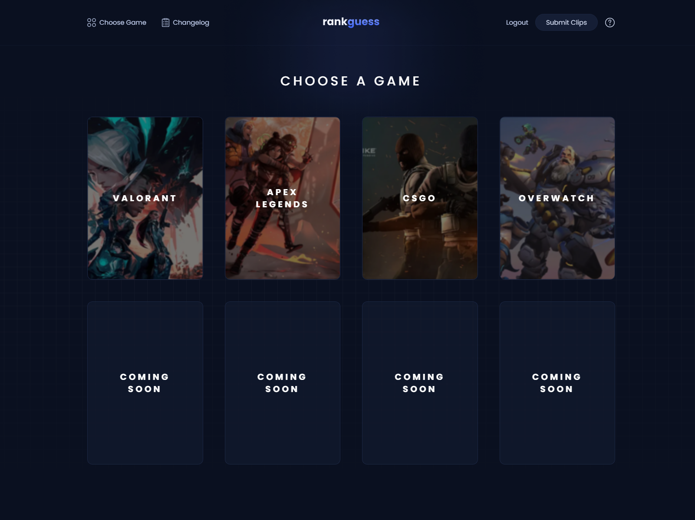

[![MIT License][license-shield]][license-url]
[![LinkedIn][linkedin-shield]][linkedin-url]

 

  

<h1 align="center">
  rankguess
</h1>

  Guess the rank of user submitted clips from Apex Legends, CSGO, League of Legends, and more!

## Table of Contents

- [About](#about)
- [Getting Started](#getting-started)
  - [Installation](#installation)
  - [Production](#production)
- [Credits](#credits)
- [Contact](#contact)
- [License](#license)

## About

A browser game based off Guess The Rank with features from Wordle. Players can pick their favourite game and guess daily on other players gameplay footage. Players are able to play without an account, although simply signing in with Google will allow them to submit their own footage for review. If accepted they will be featured in the game.

## Getting Started

Follow these steps in order to get the website up and running locally on your machine.

### Installation

- N/A. Work in progress

### Production

- N/A. Work in progress

## Credits

Inspired by various Guess The Rank styled games and Wordle.

## Contact

- [LinkedIn](https://linkedin.com/in/lucas-winkler)
- [Github](https://github.com/lucaswinkler)
- [Email](mailto:lucaswinkler@gmail.com)

## License

Distributed under the MIT License. See `LICENSE` for more information.

[license-shield]: https://img.shields.io/badge/license-MIT-blue.svg?style=flat-square
[license-url]: https://choosealicense.com/licenses/mit
